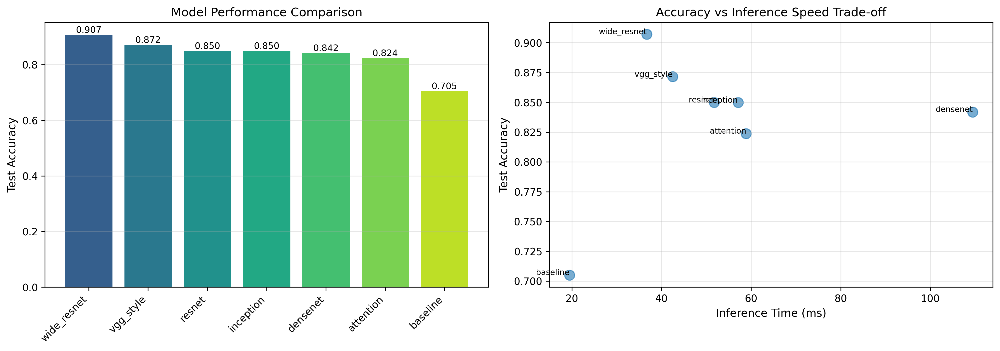

# CIFAR-10 CNN Architecture Study

A systematic comparison of seven CNN architectures for image classification on CIFAR-10, achieving **90.71% test accuracy** with Wide ResNet. This project explores the interplay between network architecture, regularization strategies, and optimization techniques for small-image classification tasks.

## Overview

This research project implements and compares multiple convolutional neural network architectures, from simple baselines to state-of-the-art designs, investigating how architectural choices affect performance on 32×32 pixel images. The study includes comprehensive experiments on regularization, optimizer selection, batch size effects, and automated hyperparameter optimization.

### Key Results

| Architecture | Parameters | Test Accuracy | Inference Time |
|--------------|------------|---------------|----------------|
| **Wide ResNet** | 11.0M | **90.71%** | 36.73ms |
| VGG-style | 2.0M | 87.15% | 42.51ms |
| ResNet | 11.3M | 84.99% | 51.76ms |
| Inception | 1.9M | 84.98% | 57.09ms |
| DenseNet | 1.3M | 84.19% | 109.49ms |
| Attention CNN | 1.3M | 82.37% | 58.90ms |
| Baseline CNN | 592K | 70.50% | 19.48ms |

## Architectures Implemented

- **Baseline CNN**: Simple 2-block convolutional network establishing performance floor
- **VGG-style**: Deep network with 3×3 convolutions, GELU activation, global average pooling
- **ResNet**: Residual connections with stochastic depth for gradient flow
- **Attention CNN**: Squeeze-and-excitation blocks for channel attention
- **DenseNet**: Dense connectivity pattern for feature reuse
- **Inception**: Multi-scale feature extraction with parallel convolution paths
- **Wide ResNet**: Widened residual blocks (width factor 8) with DropBlock regularization

## Project Structure

```
cifar10-cnn-architecture-study/
├── config.py              # Centralized hyperparameters and experiment settings
├── data_utils.py          # Data loading, augmentation, MixUp, PCA analysis
├── custom_layers.py       # DropBlock, StochasticDepth, attention mechanisms
├── models.py              # All 7 CNN architecture definitions
├── callbacks.py           # Learning rate schedulers, optimizer configurations
├── training.py            # Training loops, ensemble methods, checkpointing
├── experiments.py         # Systematic experiment runners
├── optuna_optimization.py # Bayesian hyperparameter optimization
├── visualization.py       # Plotting utilities for results analysis
├── main.py                # Main orchestration script
├── small_test.py          # Quick local testing without GPU
├── outputs/
│   ├── plots/             # Training curves, confusion matrices, comparisons
│   ├── results/           # CSV/JSON experiment results
│   └── logs/              # Training logs per model
├── requirements.txt
└── TECHNICAL_SUMMARY.md   # Detailed methodology and findings
```

## Key Findings

**Architecture insights**: Wide ResNet's superior performance validates the "wider is better" hypothesis for small images, where increased width captures more features per layer without the vanishing gradient issues of extreme depth.

**Regularization**: Batch normalization alone provided sufficient regularization—adding dropout (0.2-0.3) consistently degraded performance across all architectures, suggesting interference with batch statistics.

**Optimization**: AdamW outperformed both Adam and SGD with momentum, with decoupled weight decay proving more effective than L2 regularization for these architectures.

**Ensemble methods**: Soft voting ensemble achieved 86.04% accuracy, only marginally improving over individual models, indicating the architectures learned similar feature representations.

## Technical Details

- **Framework**: TensorFlow 2.19.0 / Keras
- **Hardware**: Google Colab L4 GPU (22.5GB VRAM)
- **Dataset**: CIFAR-10 (45K train / 5K validation / 10K test)
- **Augmentation**: Random flips, rotations (±15°), shifts (10%), zoom (10%), MixUp
- **Optimization**: Optuna with Tree-structured Parzen Estimators for hyperparameter search

## Usage

### Installation

```bash
git clone https://github.com/OscarAR46/cifar10-cnn-architecture-study.git
cd cifar10-cnn-architecture-study
pip install -r requirements.txt
```

### Running Experiments

```python
# Run all experiments (requires GPU, ~8 hours)
python main.py

# Quick local test (CPU, ~2 minutes)
python small_test.py
```

### Training a Single Model

```python
from models import create_wide_resnet
from data_utils import load_and_preprocess_data
from training import train_model

# Load data
(x_train, y_train), (x_val, y_val), (x_test, y_test) = load_and_preprocess_data()

# Create and train model
model = create_wide_resnet()
history = train_model(model, x_train, y_train, x_val, y_val, epochs=100)
```

## Results Visualisation

Training curves and confusion matrices for all architectures are available in `outputs/plots/`. The model comparison chart below summarizes accuracy vs. inference time trade-offs:



## Pre-trained Models

Trained model weights (~8 hours on Google Colab L4 GPU) are not included due to file size limits. Contact me if you'd like access to the pre-trained weights.

## Acknowledgments

This project was completed as part of the CETM26 Machine Learning & Data Mining module. The implementation draws on foundational work by He et al. (ResNet), Zagoruyko & Komodakis (Wide ResNet), Huang et al. (DenseNet), and Ghiasi et al. (DropBlock).

## License

MIT License - see [LICENSE](LICENSE) for details.
